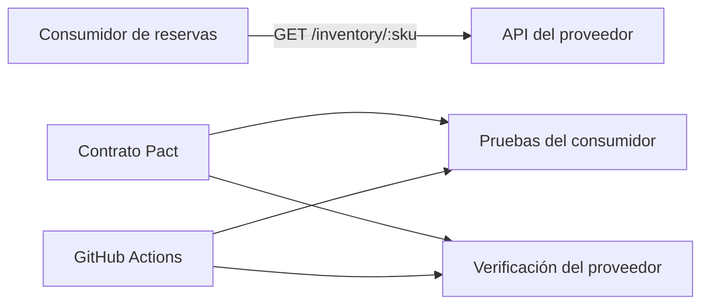

# Validación de contrato consumidor-proveedor con Pact

## Descripción general

Este repositorio demuestra una implementación de pruebas de contrato bajo el enfoque consumer-driven contract testing entre un consumidor de reservas y un proveedor de inventario, utilizando Pact V3 y Matchers V3.

La solución valida que el proveedor cumple con las expectativas reales del consumidor mediante la generación del contrato y la verificación del proveedor, sin depender de un mock para la validación final.

## Contexto del negocio

El consumidor revisa el inventario antes de aceptar una reserva. El proveedor expone un endpoint REST que devuelve el estado del producto para un SKU específico.

## Arquitectura



## Casos funcionales cubiertos

La implementación contempla tres escenarios:

1. Producto disponible
2. Producto sin stock
3. SKU no encontrado

## API del proveedor

### GET /inventory/:sku

#### Respuesta exitosa
```json
{
  "sku": "A100",
  "name": "Laptop Ultra",
  "availableQuantity": 8,
  "price": 1200,
  "status": "AVAILABLE"
}
```

#### Respuesta sin stock
```json
{
  "sku": "B200",
  "name": "Mouse Pro",
  "availableQuantity": 0,
  "price": 45,
  "status": "OUT_OF_STOCK"
}
```

#### Respuesta de SKU no encontrado
```json
{
  "code": "SKU_NOT_FOUND",
  "message": "SKU Z999 not found"
}
```

## Estados del proveedor

- available_stock
- out_of_stock
- sku_not_found

Estos estados son deterministas y específicos del dominio, y se utilizan durante la verificación del proveedor para asegurar un comportamiento predecible.

## Stack tecnológico

- Node.js 22
- TypeScript 5.x
- Vitest 2.x
- Pact V3 / Matchers V3
- Express 4.x

## Estructura del proyecto

```text
.
├── .github
│   └── workflows
│       └── ci.yml
├── consumer
│   ├── src
│   │   ├── inventoryClient.ts
│   │   └── reservationService.ts
│   ├── test
│   │   └── consumer.pact.spec.ts
│   ├── package.json
│   └── tsconfig.json
├── pact
│   └── pacts
│       └── reservation-consumer-inventory-provider.json
├── provider
│   ├── src
│   │   ├── inventoryStore.ts
│   │   └── server.ts
│   ├── test
│   │   └── provider.verification.spec.ts
│   ├── package.json
│   └── tsconfig.json
├── .gitattributes
├── .gitignore
├── package.json
├── README.md
├── package-lock.json
└── tsconfig.json
```

## Inicio rápido

```bash
npm install
npm run test:consumer
npm run pact:generate
npm run verify:provider
npm run ci
```

## Flujo de CI

El workflow de GitHub Actions ejecuta las pruebas del consumidor, genera el contrato Pact y verifica el proveedor contra la implementación real.

## Calidad y seguridad

- No se almacenan credenciales ni secretos en el repositorio.
- No se incluye información sensible en la implementación.
- La validación se basa en evidencia ejecutada y pruebas reproducibles.
- La solución está enfocada en un caso realista de contract testing, manteniendo un diseño claro y profesional.

## Observación

La carpeta docs contiene materiales de apoyo y documentación complementaria del proyecto, que se mantienen separados para una presentación más ordenada y profesional.
