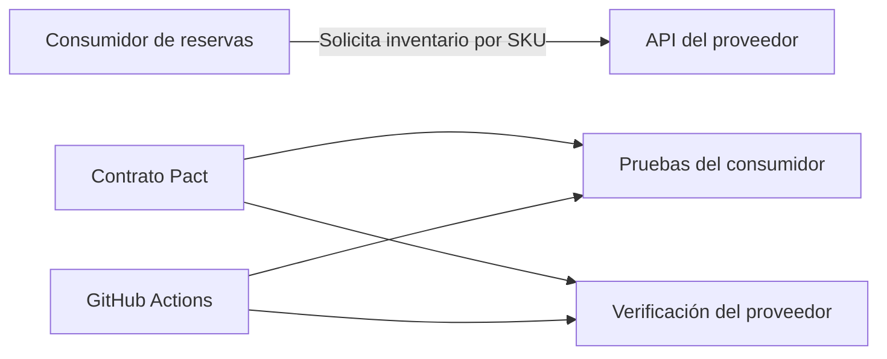
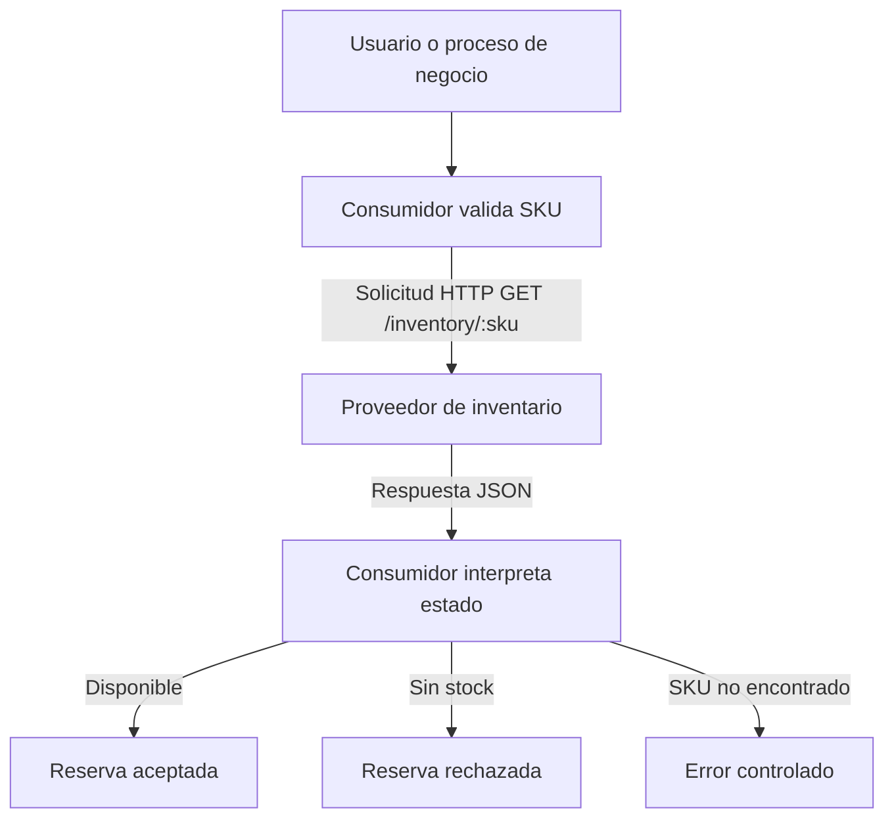
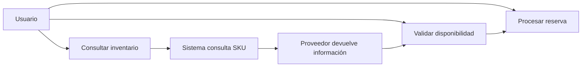
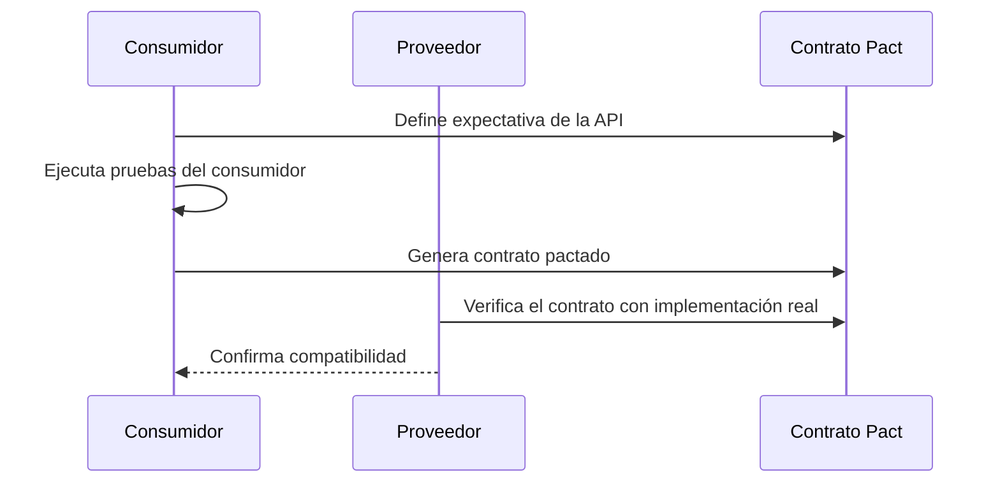

# Validación de contrato consumidor-proveedor con Pact

## Descripción general

Este repositorio implementa una solución de contract testing con Pact para validar la relación entre un consumidor y un proveedor de inventario. El objetivo es garantizar que la API del proveedor cumpla exactamente con las expectativas del consumidor antes de integrarse en producción.

La solución sigue el enfoque consumer-driven contract testing, donde el consumidor define el contrato, lo publica y el proveedor lo verifica contra su implementación real.

## Contexto del negocio

El consumidor revisa el inventario antes de aceptar una reserva. Para ello, utiliza un endpoint REST que devuelve el estado del producto según el SKU solicitado.

El sistema cubre escenarios reales de negocio como disponibilidad, agotamiento de stock y ausencia del producto.

## Arquitectura del sistema



## Diagrama de flujo de datos



## Diagramas de casos de uso



### Casos de uso principales

1. Consultar información de un SKU existente con disponibilidad.
2. Consultar un SKU existente sin stock disponible.
3. Consultar un SKU inexistente.
4. Validar que el consumidor y el proveedor compartan un contrato común.
5. Verificar el proveedor con su implementación real.

## Casos funcionales cubiertos

La implementación contempla estos escenarios:

1. Producto disponible
2. Producto sin stock
3. SKU no encontrado

## API del proveedor

### GET /inventory/:sku

#### Respuesta exitosa
```json
{
  "sku": "A100",
  "name": "Laptop Ultra",
  "availableQuantity": 8,
  "price": 1200,
  "status": "AVAILABLE"
}
```

#### Respuesta sin stock
```json
{
  "sku": "B200",
  "name": "Mouse Pro",
  "availableQuantity": 0,
  "price": 45,
  "status": "OUT_OF_STOCK"
}
```

#### Respuesta de SKU no encontrado
```json
{
  "code": "SKU_NOT_FOUND",
  "message": "SKU Z999 not found"
}
```

## Estados del proveedor

- available_stock
- out_of_stock
- sku_not_found

Estos estados son deterministas y específicos del dominio, y se utilizan durante la verificación del proveedor para asegurar un comportamiento predecible.

## Stack tecnológico

- Node.js 22
- TypeScript 5.x
- Vitest 2.x
- Pact V3 / Matchers V3
- Express 4.x

## Estructura del proyecto

```text
.
├── .github
│   └── workflows
│       └── ci.yml
├── consumer
│   ├── src
│   │   ├── inventoryClient.ts
│   │   └── reservationService.ts
│   ├── test
│   │   └── consumer.pact.spec.ts
│   ├── package.json
│   └── tsconfig.json
├── pact
│   └── pacts
│       └── reservation-consumer-inventory-provider.json
├── provider
│   ├── src
│   │   ├── inventoryStore.ts
│   │   └── server.ts
│   ├── test
│   │   └── provider.verification.spec.ts
│   ├── package.json
│   └── tsconfig.json
├── .gitattributes
├── .gitignore
├── package.json
├── README.md
├── package-lock.json
└── tsconfig.json
```

## Flujo del proceso con Pact



## Inicio rápido

```bash
npm install
npm run test:consumer
npm run pact:generate
npm run verify:provider
npm run ci
```

## Flujo de CI

El workflow de GitHub Actions ejecuta las pruebas del consumidor, genera el contrato Pact y verifica el proveedor contra la implementación real.

## Calidad y seguridad

- No se almacenan credenciales ni secretos en el repositorio.
- No se incluye información sensible en la implementación.
- La validación se basa en evidencia ejecutada y pruebas reproducibles.
- La solución se enfoca en un caso realista de contract testing, manteniendo un diseño claro y profesional.

## Observación

La carpeta docs contiene materiales complementarios del proyecto, como el manual técnico y el manual de usuario, y se mantiene separada del repositorio público para una presentación más ordenada y profesional.
